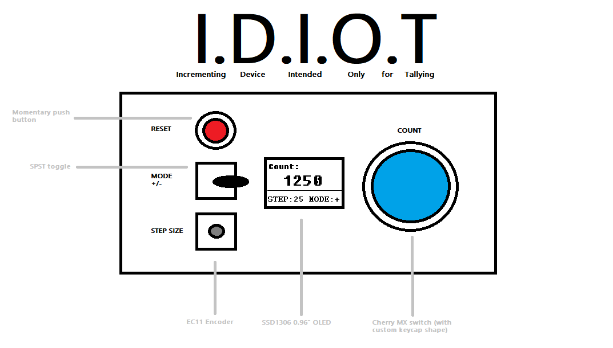

# I.D.I.O.T (Incrementing Device Intended Only for Tallying)

## What the hell is this? 

Literally just a simple counter box, I made this because at my data entry job I was keeping track of my output manually which sucks. I then tried a web based counter, but because I only had two monitors it was annoying switching tabs to update the counter after everything I did. Thus, this stupid overengineered up/ down counter was born.

Yeah, I also realized too late that the name doesnt totally make sense since it can both increment and decrement. Oh well, I guess that makes it funnier? 

## Version 1 stuff 

### The Vision

This will probably just be a one off project, and will be open source for anyone who also wants a stupid useless desk counter. It will probably just use super simple basic components, but maybe I'll upgrade them eventually for a version 2. Potentially would also make a PCB version just for practice. 

Below you can see my original vision for the layout, as well as a beautiful render thanks to ChatGPT. God knows I don't possess the skills or time to make a render like this so yay for technology!

### Components required (Version 1)

- SSD1306 0.96" OLED
- Momentary Push Button
- SPST Toggle Switch
- EC11 Encoder
- Cherry MX Switch
- Pro Micro

### Pinout Table

Coming soon along with a wiring schematic!
